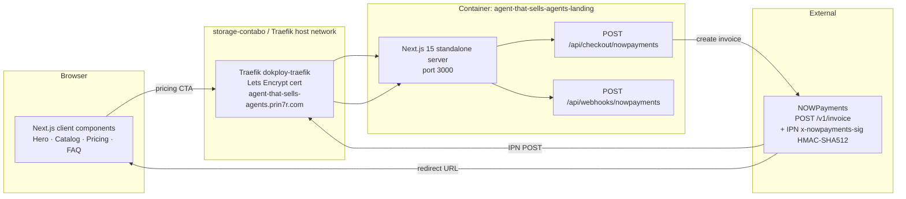

# 02 — Architecture

## System overview

Provenance is a Next.js 15 (App Router) landing with a small server-side surface. The shape is intentionally narrow for v1: one route renders the site, two routes wrap NOWPayments. The future "app" tier (`apps/app/`) will be open-saas-derived and is stubbed for now.

## Components

| Component | Responsibility | Path |
|-----------|----------------|------|
| Site shell | App Router root layout, theme tokens, fonts | `apps/landing/app/layout.tsx` |
| Landing page | Hero, catalog, provenance, outcomes, pricing, FAQ | `apps/landing/app/page.tsx` |
| Concierge rail | Scripted "agent talking" UI on hero | `apps/landing/components/ConciergeRail.tsx` |
| Catalog grid | 6 AgentCards | `apps/landing/components/CatalogGrid.tsx` |
| Provenance table | Dark-section table | `apps/landing/components/ProvenanceTable.tsx` |
| Pricing tiers | Trial / Pro / Enterprise with NOWPayments CTAs | `apps/landing/components/PricingTier.tsx` |
| Checkout API | Server-side wrapper for `POST /v1/invoice` | `apps/landing/app/api/checkout/nowpayments/route.ts` |
| Webhook API | Verifies HMAC-SHA512 IPN, writes a log line | `apps/landing/app/api/webhooks/nowpayments/route.ts` |
| Signatures lib | `verifyNowpaymentsIpn` (sorted JSON, sha512) | `apps/landing/lib/signatures.ts` |

## Data flow — checkout

1. Buyer clicks **Buy** on a `PricingTier`.
2. Client `POST /api/checkout/nowpayments` with `{ tierId, agentId? }`.
3. Server reads `NOWPAYMENTS_API_KEY`, builds an invoice payload (price, callback, success/cancel URLs, `order_id` = `tierId-uuid`), `POST https://api.nowpayments.io/v1/invoice`.
4. Server returns `{ invoiceUrl, orderId }`. Client navigates to `invoiceUrl`.
5. Buyer pays on the NOWPayments hosted page.
6. NOWPayments calls `POST /api/webhooks/nowpayments` with `x-nowpayments-sig`.
7. Server verifies HMAC-SHA512 against `NOWPAYMENTS_IPN_SECRET` over a sorted-key JSON of the body. On `payment_status: finished`, the order is marked paid.

## Deploy topology

| Layer | Detail |
|-------|--------|
| DNS | Cloudflare wildcard `*.prin7r.com → 161.97.99.120` |
| Edge | dokploy-traefik (host network) on `storage-contabo` |
| Container | `agent-that-sells-agents-landing` from `Dockerfile.landing`, exposes 3000 |
| TLS | Let's Encrypt HTTP-01 via the `letsencrypt` resolver |
| Env | `/opt/prin7r-deploys/agent-that-sells-agents/.env` (gitignored, server-only) loaded via `env_file: .env` in compose |

## Constraints (deliberate, v1)

- No database. The webhook log line is plain console output; the future app tier will own persistence.
- No auth on `/api/checkout/*` — the route is rate-limited at Traefik later if abused, and exposes only invoice creation, never sensitive data.
- No queue. NOWPayments retries IPNs natively; we accept that and respond `200` only on verified payloads.
