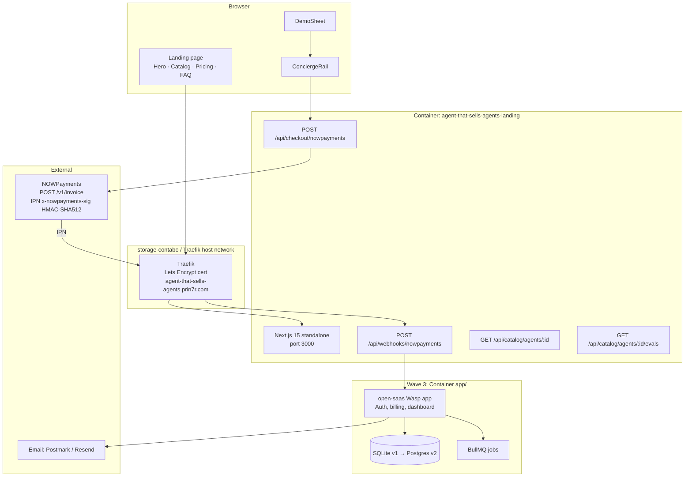
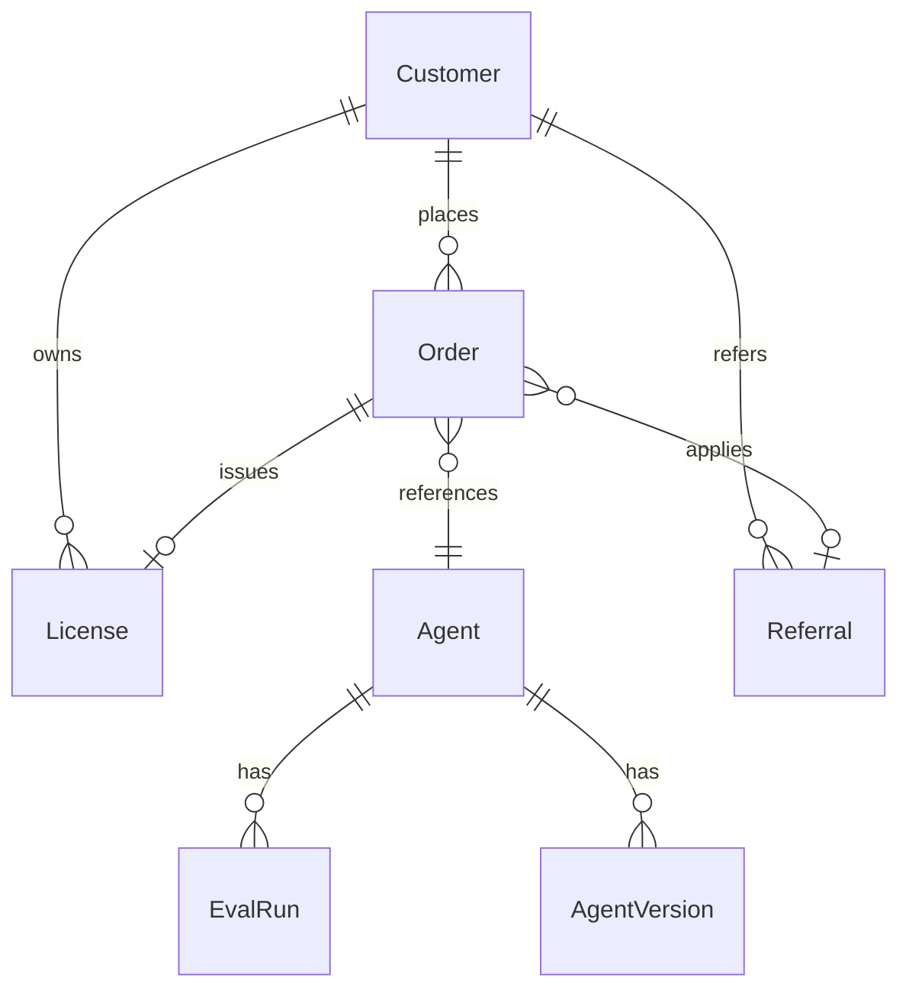

# 12 — Technical Specification

This is the authoritative technical contract for Provenance Wave 2 → Wave 3. Doc 11 specifies the user-visible flows; this doc specifies the runtime, schema, contracts, and operational guardrails the implementation must respect. Every endpoint here traces back to a story in doc 11. Every entity here is the canonical name to be used in code.

---

## 1. Architecture overview

The Wave 2 surface is a Next.js 15 (App Router) landing with two server routes (checkout + webhook). Wave 3 expands `apps/app/` into an open-saas-derived dashboard.



**Runtime detail (Wave 2):** single Next.js standalone container, no DB, console logs only. Order persistence happens entirely on NOWPayments side until Wave 3 adds the open-saas app.

**Runtime detail (Wave 3):** Adds a sibling `apps/app/` open-saas container with SQLite (MVP) → Postgres migration path. BullMQ queues handle async jobs (digest generation, eval-runner, payout reconciliation).

---

## 2. Data model

### 2.1 Entities



### 2.2 Schema sketch (Drizzle for Wave 3 open-saas)

```typescript
// apps/app/src/db/schema.ts
export const customers = pgTable('customers', {
  id: uuid('id').primaryKey().defaultRandom(),
  email: text('email').notNull().unique(),
  name: text('name'),
  agencyPartnerCode: text('agency_partner_code'), // null unless an agency
  createdAt: timestamp('created_at').defaultNow(),
});

export const agents = pgTable('agents', {
  id: text('id').primaryKey(),         // 'lot-042'
  lotNumber: integer('lot_number').notNull().unique(),
  displayName: text('display_name').notNull(), // 'Anders, SDR'
  category: text('category').notNull(),         // 'sdr' | 'support' | 'research'
  provenanceTrainedBy: text('provenance_trained_by').notNull(),
  provenanceShipCount: integer('provenance_ship_count').notNull(),
  provenanceCostPerAction: numeric('cost_per_action', {precision:10,scale:4}),
  driftStatus: text('drift_status').default('green'),  // green|yellow|red
  publicEvalLogJson: jsonb('public_eval_log').default('[]'),
});

export const orders = pgTable('orders', {
  id: text('id').primaryKey(),         // 'trial-{uuid}-lot-042'
  customerId: uuid('customer_id').references(() => customers.id),
  agentId: text('agent_id').references(() => agents.id),
  tier: text('tier').notNull(),                 // 'trial' | 'pro' | 'enterprise'
  status: text('status').default('pending'),    // 'pending'|'paid'|'refunded'|'expired'
  priceAmountUsd: numeric('price_amount_usd', {precision:10,scale:2}),
  paymentProvider: text('payment_provider').default('nowpayments'),
  invoiceId: text('invoice_id'),
  paidAt: timestamp('paid_at'),
  refundedAt: timestamp('refunded_at'),
  referralCode: text('referral_code'),
  createdAt: timestamp('created_at').defaultNow(),
});

export const licenses = pgTable('licenses', {
  id: uuid('id').primaryKey().defaultRandom(),
  orderId: text('order_id').references(() => orders.id),
  customerId: uuid('customer_id').references(() => customers.id),
  agentId: text('agent_id').references(() => agents.id),
  tier: text('tier').notNull(),
  validUntil: timestamp('valid_until').notNull(),
  revokedAt: timestamp('revoked_at'),
});

export const referrals = pgTable('referrals', {
  code: text('code').primaryKey(),     // 'AGENCY-NYC-014'
  agencyName: text('agency_name').notNull(),
  contactEmail: text('contact_email').notNull(),
  revShareBps: integer('rev_share_bps').default(3000),  // 30%
  active: boolean('active').default(true),
});
```

Indexes: `orders(customer_id, status)`, `orders(invoice_id)` unique partial where `invoice_id IS NOT NULL`, `licenses(customer_id, agent_id, valid_until)`.

---

## 3. API contracts

All endpoints return JSON. Errors use the shape `{ error: { code: string, message: string, details?: any } }` with HTTP 4xx/5xx.

### 3.1 `GET /api/catalog/agents/:agentId`

- Auth: none.
- Path: `agentId` like `lot-042`.
- Response 200: `{ id, lotNumber, displayName, category, provenance: { trainedBy, shipCount, costPerAction }, driftStatus, recentEvalsSummary }`.
- Errors: 404 `agent_not_found`.

### 3.2 `POST /api/checkout/nowpayments`

- Auth: none (referral code optional).
- Body: `{ tierId: 'trial'|'pro'|'enterprise', agentId: string, referralCode?: string, upgradeFrom?: string }`.
- Server flow: build `order_id = {tier}-{uuid}-{agentId}`; build NOWPayments payload `{ price_amount, price_currency: 'usd', order_id, order_description, ipn_callback_url, success_url, cancel_url }`; `POST https://api.nowpayments.io/v1/invoice` with `x-api-key: NOWPAYMENTS_API_KEY`; persist a pending order (Wave 3) or just return checkout URL (Wave 2).
- Response 201: `{ orderId, checkoutUrl, invoiceId }`.
- Errors: 400 `invalid_tier`, 400 `agent_not_found`, 502 `nowpayments_unavailable`.

### 3.3 `POST /api/webhooks/nowpayments`

- Auth: HMAC-SHA512 signature in `x-nowpayments-sig` header over a sorted-keys JSON of the body, signed with `NOWPAYMENTS_IPN_SECRET`. Constant-time compare via `crypto.timingSafeEqual`.
- Body: NOWPayments IPN payload (`order_id`, `payment_status`, `pay_amount`, `pay_currency`, `actually_paid`, …).
- Server flow: verify sig → look up order → if `payment_status == 'finished'`, mark `paid`, issue license, accrue rev-share if `referralCode` present, send email. Idempotent on `(order_id, payment_status)`.
- Response 200 `{ ok: true }` only on verified payloads. 401 on bad sig. 200 on already-processed (idempotent).

### 3.4 `GET /api/catalog/agents/:agentId/evals?since=90d`

- Auth: none.
- Response 200: `{ agentId, runs: [{ corpus, scoreBps, evaluator, runDate }, …], baselineBps, current30dMeanBps }`.

### 3.5 `POST /api/admin/invoices` (Wave 3)

- Auth: Bearer `ADMIN_API_KEY`.
- Body: `{ customerId, tier: 'enterprise', agentIds: string[], priceAmountUsd, expiresAt? }`.
- Response 201: `{ orderId, invoiceUrl }`. Used by Concierge for Enterprise close.

### 3.6 `POST /api/billing/switch-mode` (Wave 3)

- Auth: Bearer customer JWT.
- Body: `{ orderId, mode: 'flat'|'outcome', cap?: number }`.
- Response 200: `{ orderId, effectiveAt, mode, cap }`.

### 3.7 `POST /api/admin/orders/:orderId/refund` (Wave 3)

- Auth: Bearer `ADMIN_API_KEY`.
- Body: `{ reason }`.
- Response 200: `{ orderId, refundedAt, licenseRevoked: true }`.

### 3.8 Webhook contract — outbound digest delivery (Wave 3)

The weekly digest is generated by a BullMQ worker reading `licenses + agents + evalRuns` and emits a Postmark template message. No external webhook surface — internal job only.

---

## 4. Integrations

| Service | Purpose | Auth | Rate limit | Fallback |
|---|---|---|---|---|
| **NOWPayments** | Hosted invoice + IPN (default rail) | `x-api-key: NOWPAYMENTS_API_KEY` | 60 req/min on `POST /v1/invoice`; IPN side has no doc'd cap | On `502`, retry 3x with exp-backoff; surface "checkout temporarily unavailable" toast |
| **Plisio** (Wave 3) | Backup stablecoin invoice | `apiKey` query param | n/a | Render `coming soon` until Wave 3 wires it |
| **Reown / WalletConnect** (Wave 3) | Direct-wallet pay fallback | Project ID | n/a | Hidden in Wave 2 |
| **Postmark** (Wave 3) | Transactional email | Server token | 5k req/hour Pro plan | Buffered in Bull queue; retry on 5xx |
| **NOWPayments admin dashboard** | Refunds (Wave 2 manual) | OAuth in browser | n/a | Concierge handles |

No LLM provider integrations in Wave 2 — the demo is scripted, not live. Wave 3 BYO-endpoint adds Bedrock / Vertex / Azure OpenAI as customer-supplied integrations.

---

## 5. Storage

- **Wave 2.** No DB. Webhook receipts are logged to stdout; `docker logs <container>` is the audit trail. NOWPayments dashboard is the source of truth for invoices.
- **Wave 3 MVP.** SQLite (file-mounted volume on storage-contabo at `/opt/prin7r-deploys/agent-that-sells-agents/data/app.sqlite`).
- **Wave 3 scale.** Postgres 15 on the same host (Wave 4 may move to a managed Neon/Supabase if traffic warrants).
- **Retention.** Orders retained 7 years (tax compliance). Eval runs retained 24 months. Webhook logs retained 30 days. PII (email, name) retained per GDPR — deleted on customer request, with order email replaced by hash.

---

## 6. Auth

- **Public landing.** No auth.
- **Customer dashboard (Wave 3).** Magic-link email auth (open-saas default). Session cookie httpOnly secure samesite=lax, 30-day TTL.
- **Admin endpoints.** Bearer `ADMIN_API_KEY` (rotated every 90 days, scoped to a single human operator, stored in 1Password; never in repo).
- **No SSO in Wave 2/3.** SSO defers to Wave 4 if Enterprise demand exceeds 5 named customers.
- **No public account creation.** Accounts are minted on first paid order — magic link sent post-payment.

---

## 7. Security

Top 5 threats + mitigations:

1. **Forged IPN.** *Mitigation:* HMAC-SHA512 with constant-time compare; reject any IPN without a matching `order_id` we created. Logs include the rejected sig for investigation.
2. **Replay of IPN.** *Mitigation:* Idempotent on `(order_id, payment_status)`; ledger rejects same `(order_id, status='finished')` after first acceptance.
3. **Referral-code spam.** *Mitigation:* Codes pre-registered in `referrals` table with `active=true`. Unknown codes are accepted at the order level but accrue $0 rev-share until activated.
4. **Brute-force on admin endpoints.** *Mitigation:* Bearer-only, no cookie auth on `/api/admin/*`. Traefik rate limit 10 req/min per IP. Failures emit a Slack alert via webhook.
5. **PII leak via webhook logs.** *Mitigation:* Logs scrub `pay_address`, `payout_hash`, and customer email at the line-format step. Stdout never contains plaintext secrets. `.env` is gitignored and lives only on the deploy host.

CSRF: handled by Next.js default (samesite=lax cookie + same-origin form posts). CORS: `Access-Control-Allow-Origin` set to `https://agent-that-sells-agents.prin7r.com` only. Rate limits applied at Traefik per route: `/api/checkout/*` 30 req/min/IP, `/api/webhooks/*` 600 req/min total (NOWPayments retries).

---

## 8. Observability

- **Logs.** Stdout JSON lines `{ ts, level, route, orderId?, event, message }`. Container logs scraped by Loki (Wave 4) or `docker logs` (Wave 2).
- **Metrics.** Wave 3 emits Prometheus counters: `orders_created_total`, `orders_paid_total`, `webhook_verifications_failed_total`, `checkout_invoice_create_latency_seconds_p95`. Wave 2 metrics derive from log greps.
- **Alerts.**
  - Webhook signature failures >5/hour → Slack `#alerts-provenance`.
  - Checkout invoice creation p95 >2s for 5 min → Slack.
  - Daily orders count <2 stddev below 30-day mean → Slack (anomaly detection).
- **Trace propagation.** Single `requestId` UUID minted at edge, passed via `x-request-id` to backend log lines. No distributed tracing infrastructure in Wave 2/3.

---

## 9. Performance budgets

| Surface | Metric | Budget |
|---|---|---|
| Landing TTFB | p95 | <200ms |
| Landing LCP | p75 | <2.5s |
| `POST /api/checkout/nowpayments` | p95 | <1.5s end-to-end (includes NOWPayments roundtrip) |
| `POST /api/webhooks/nowpayments` | p95 | <250ms (verify + persist) |
| `GET /api/catalog/agents/:id` | p95 | <100ms (in-memory or 1 SQL select) |
| Throughput | sustained | 50 RPS landing, 10 RPS checkout, 100 RPS webhook (NOWPayments retries) |
| Capacity | concurrent | 200 concurrent active sessions before adding a second container |

---

## 10. Non-goals

- **No agent builder UI.** The catalog is curated. Adding a "create your own agent" flow is out of scope (see doc 11 §5 AS-1).
- **No free tier.** Trial floor is $99/mo (AS-2).
- **No public coupon codes** (AS-3). Discounts via Concierge only.
- **No card payments in Wave 2/3.** Crypto-only (NOWPayments → wallet). Card via NOWPayments fiat-on-ramp partner appears at checkout but is not a separate UI surface.
- **No live LLM demos.** Demos are scripted for cost + latency reasons. Wave 4 may revisit.
- **No SSO / SAML.** Magic-link auth is sufficient through Wave 4.
- **No procurement-grade MSA flows** (AS-4). Standard terms only.
- **No mobile-native apps.** Responsive web only. Wave 5+.
